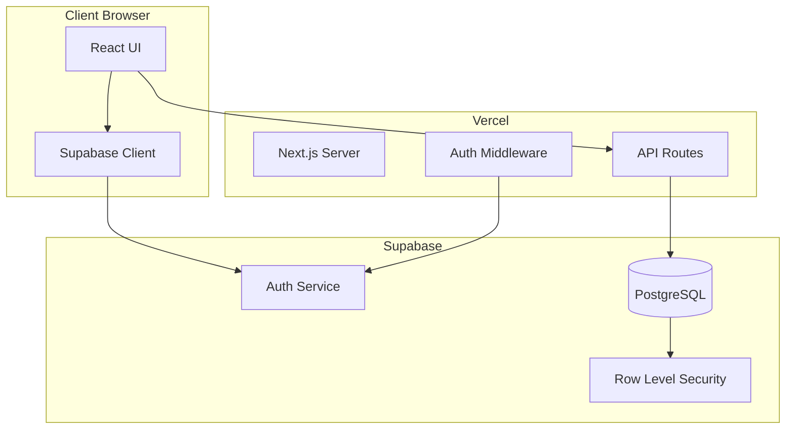
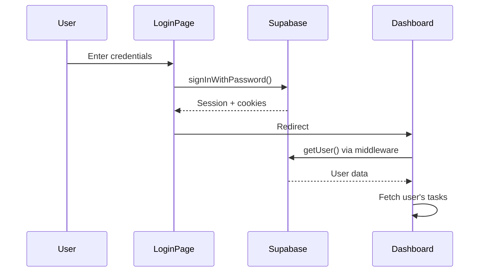
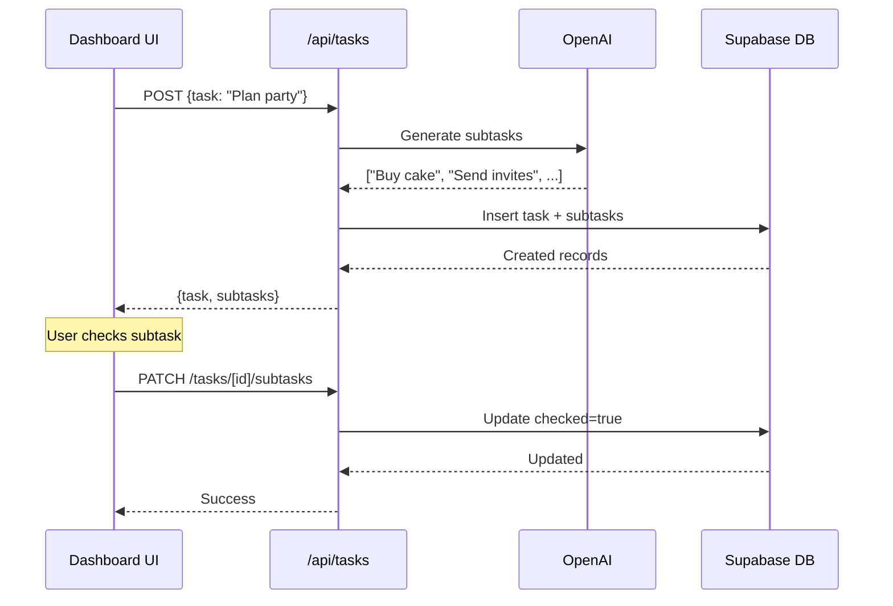

# Supabase Integration Plan

## Overview

Integrate Supabase authentication and database into the TaskBreaker Next.js app to allow users to sign in and persist their tasks with subtask checkbox states, deployed via Vercel.

## Todos

- [ ] Create Supabase project and configure auth providers
- [ ] Create tasks and subtasks tables with RLS policies
- [ ] Install @supabase/supabase-js and @supabase/ssr packages
- [ ] Create Supabase client utilities (browser + server)
- [ ] Implement auth middleware to protect /dashboard routes
- [ ] Create login and signup pages with AuthForm component
- [ ] Create API routes for tasks CRUD and subtask updates
- [ ] Create protected dashboard page showing user's tasks
- [ ] Update home page to redirect authenticated users or integrate with dashboard
- [ ] Add Supabase environment variables to Vercel dashboard

---

## Architecture Overview



## 1. Supabase Project Setup

**In Supabase Dashboard:**

- Create a new Supabase project at [supabase.com](https://supabase.com)
- Note down: `Project URL` and `anon` public key
- Enable Email auth provider (Authentication > Providers)

## 2. Database Schema

Create two tables in Supabase SQL Editor:

```sql
-- Tasks table
create table tasks (
  id uuid default gen_random_uuid() primary key,
  user_id uuid references auth.users(id) on delete cascade not null,
  title text not null,
  created_at timestamptz default now() not null
);

-- Subtasks table
create table subtasks (
  id uuid default gen_random_uuid() primary key,
  task_id uuid references tasks(id) on delete cascade not null,
  text text not null,
  checked boolean default false not null,
  position int not null,
  created_at timestamptz default now() not null
);

-- Indexes for performance
create index tasks_user_id_idx on tasks(user_id);
create index subtasks_task_id_idx on subtasks(task_id);
```

## 3. Row Level Security (RLS) Policies

```sql
-- Enable RLS
alter table tasks enable row level security;
alter table subtasks enable row level security;

-- Tasks: Users can only access their own tasks
create policy "Users can view own tasks"
  on tasks for select using (auth.uid() = user_id);

create policy "Users can insert own tasks"
  on tasks for insert with check (auth.uid() = user_id);

create policy "Users can delete own tasks"
  on tasks for delete using (auth.uid() = user_id);

-- Subtasks: Users can access subtasks of their tasks
create policy "Users can view own subtasks"
  on subtasks for select using (
    task_id in (select id from tasks where user_id = auth.uid())
  );

create policy "Users can insert own subtasks"
  on subtasks for insert with check (
    task_id in (select id from tasks where user_id = auth.uid())
  );

create policy "Users can update own subtasks"
  on subtasks for update using (
    task_id in (select id from tasks where user_id = auth.uid())
  );
```

## 4. Install Dependencies

```bash
npm install @supabase/supabase-js @supabase/ssr
```

## 5. Environment Variables

Add to `.env.local` (and Vercel dashboard):

```
NEXT_PUBLIC_SUPABASE_URL=your-project-url
NEXT_PUBLIC_SUPABASE_ANON_KEY=your-anon-key
```

Note: These use `NEXT_PUBLIC_` because Supabase client runs in browser. The anon key is safe to expose - RLS protects data.

## 6. File Structure (New/Modified Files)

```
/taskbreaker
  /lib
    /supabase
      client.ts        # Browser client
      server.ts        # Server client for API routes
      middleware.ts    # Auth middleware helper
    /schemas
      auth.schema.ts   # Zod schemas for auth
      task.schema.ts   # Zod schemas for tasks
  /app
    /api
      /tasks
        route.ts       # CRUD for tasks
      /tasks/[id]/subtasks
        route.ts       # Update subtask checked state
    /(auth)
      /login
        page.tsx       # Login page
      /signup
        page.tsx       # Signup page
    /dashboard
      page.tsx         # Protected: user's tasks list
    middleware.ts      # Protect routes
  /components
    AuthForm.tsx       # Reusable auth form
    TaskCard.tsx       # Task with subtasks display
    Header.tsx         # Navigation with auth state
```

## 7. Key Implementation Files

**`lib/supabase/client.ts`** - Browser client:

```typescript
import { createBrowserClient } from '@supabase/ssr'

export function createClient() {
  return createBrowserClient(
    process.env.NEXT_PUBLIC_SUPABASE_URL!,
    process.env.NEXT_PUBLIC_SUPABASE_ANON_KEY!
  )
}
```

**`lib/supabase/server.ts`** - Server client for API routes/Server Components:

```typescript
import { createServerClient } from '@supabase/ssr'
import { cookies } from 'next/headers'

export async function createClient() {
  const cookieStore = await cookies()
  return createServerClient(
    process.env.NEXT_PUBLIC_SUPABASE_URL!,
    process.env.NEXT_PUBLIC_SUPABASE_ANON_KEY!,
    {
      cookies: {
        getAll() { return cookieStore.getAll() },
        setAll(cookiesToSet) {
          cookiesToSet.forEach(({ name, value, options }) =>
            cookieStore.set(name, value, options)
          )
        },
      },
    }
  )
}
```

**`middleware.ts`** - Protect routes:

```typescript
import { createServerClient } from '@supabase/ssr'
import { NextResponse, type NextRequest } from 'next/server'

export async function middleware(request: NextRequest) {
  // Refresh session and protect /dashboard routes
}

export const config = {
  matcher: ['/dashboard/:path*']
}
```

## 8. Auth Flow



## 9. Data Flow for Tasks



## 10. Vercel Deployment

1. Add environment variables in Vercel Dashboard:
   - `NEXT_PUBLIC_SUPABASE_URL`
   - `NEXT_PUBLIC_SUPABASE_ANON_KEY`
   - `OPENAI_API_KEY` (already configured)

2. Supabase automatically handles CORS for your Vercel domain

3. No additional configuration needed - push to main and deploy

## Security Considerations

- RLS policies ensure users only access their own data
- Supabase `anon` key is safe to expose (RLS enforces access control)
- Auth tokens stored in HTTP-only cookies (handled by @supabase/ssr)
- Input validation with Zod on all API routes
- Rate limiting recommended for production (Vercel KV or Upstash)
